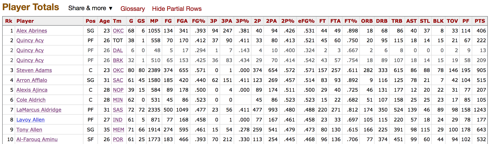
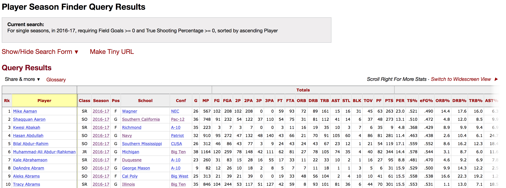
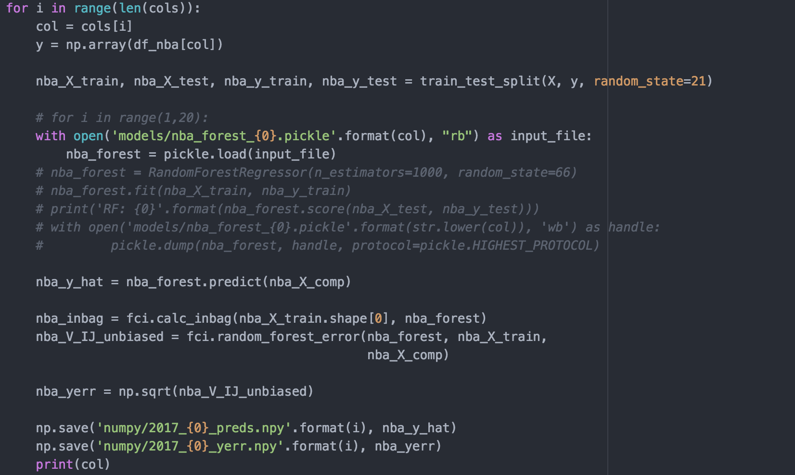
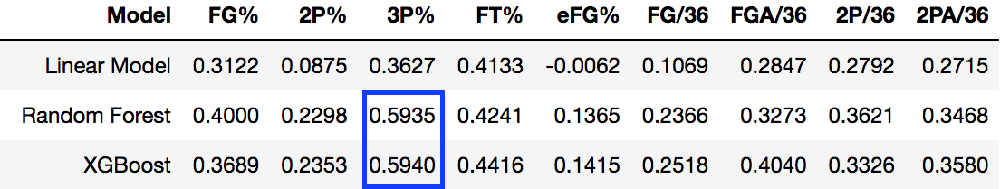
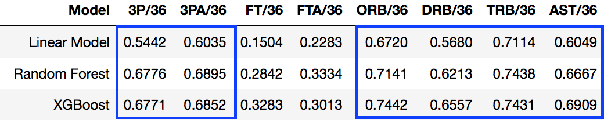
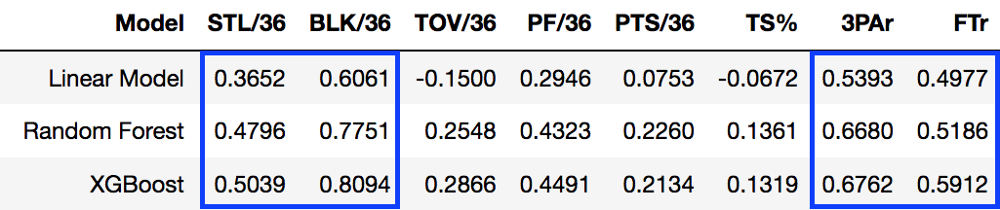
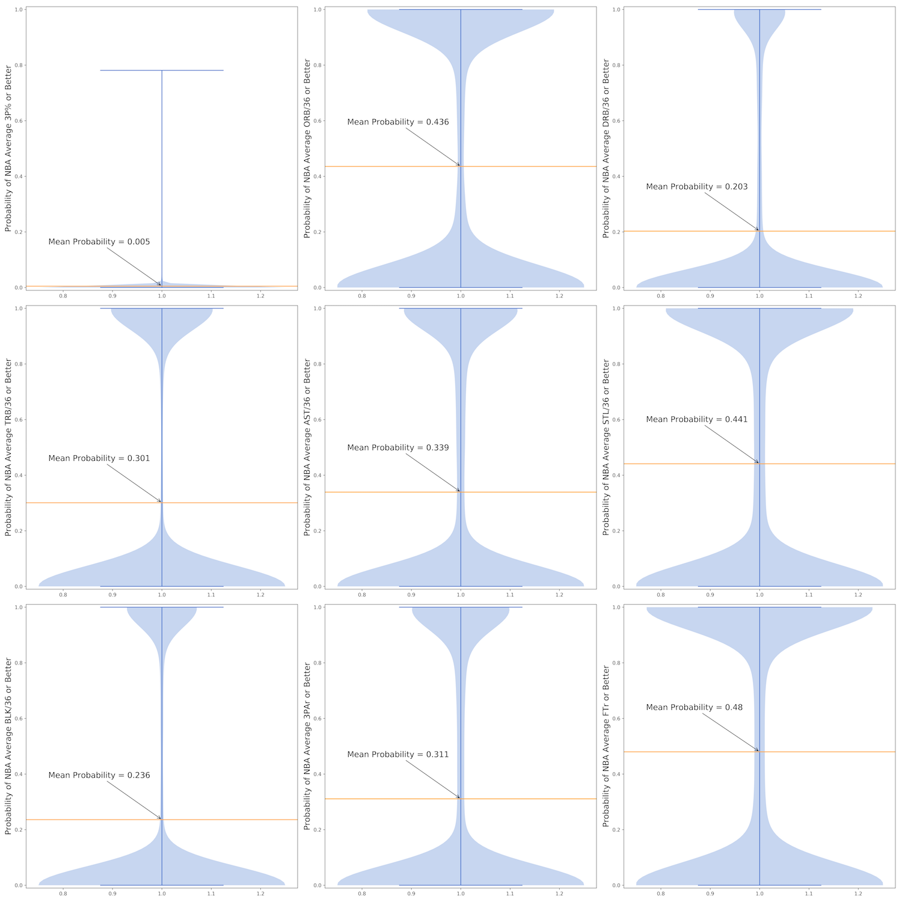

# Hooplicator

## Mission Statement
In the National Basketball Association (NBA), teams operate under a salary cap, meaning there is a finite amount of money they are allowed to spend on players. Because of this, being able to spend efficiently and derive the most “bang for your buck” on player salaries is of the utmost importance.

Where this becomes difficult is when a team has a player who fits its system really well but suddenly, due to contract expiry, becomes much pricier. Ideally, the team would be able to replicate the costlier player’s production without having to break the bank to keep them by finding a ‘Hooplicate.’

With the above in mind, the goals for the Hooplicator are twofold:

1. Create a model that enables teams to identify players who will be able to replicate the production of a given current player.

2. Identify player skills that, based on the model, are more easily replaceable to prioritize where teams should be willing to spend and where they can expect production from replacement-level talent.

## Table of Contents
1. [Data Collection](#data-collection)
2. [Data Prep](#data-prep)
    * [Glossary](#glossary)
3. [Approach](#approach)
4. [Model Selection](#model-selection)
5. [Results](#results)
6. [Conclusions](#conclusions)
7. [Next Steps](#next-steps)
8. [References](#references)

## Data Collection

All data for the project was scraped from Basketball-Reference.com and its sibling site Sports-Reference.com (for college basketball statistics) using BeautifulSoup to collect data from the yearly statistics into a list of numpy arrays (by row), compiled into a Pandas dataframe.

 
<em>An example of the tables from which the NBA data was scraped.</em>

 
<em>An example of the tables from which the NCAA data was scraped.</em>

For certain players with insufficient minutes or from years where certain statistic were not available, additional code was placed into the scraper to input NaN values where the table remained empty, in order to keep row lengths the same during the compilation process.

## Data Prep

Most of the data came packaged the way I needed it, but I did have to do some minor feature engineering to account for playing time. For college players, I added stats per 40 minutes. For NBA players, I used stats per 36. In order to get college career data compiled, I took individual seasons and summed the raw stats while taking weighted averages for cumulative metrics like PER and BPM.

Since the scraped NBA data did not have any identifying features to resolve situations where there were duplicate names (in addition to some players having transferred), I relied on comparing final college season to first NBA season to make sure I was looking at the right player, and in the cases of multiple players with the same names, resolved a number of issues manually by simply checking their Sports-Reference page and seeing if it was linked to an NBA-level Basketball-Reference page. Had I gone page-by-page when I scraped Basketball-Reference, I would have been able to compare against the college listed or based on player ID; however, having scraped from the full-year statistics page, I ended up having to do more work here as a trade-off for the convenience it afforded me earlier on.

### Glossary

| Statistic  | Meaning  |
|---|---|
| FG% | Field Goal Percentage   (FG/FGA) |
| 2P% | 2-Point Field Goal Percentage   (2P/2PA) |
| 3P% | 3-Point Field Goal Percentage   (3P/3PA) |
| FT% | Free Throw Percentage   (FT/FTA) |
| FG/36 or   FGA/36 | Field Goals (Attempts) Per 36 Minutes   (FG or FGA/Minutes Played) x 36 |
| 2P/36 or   2PA/36 | 2-Point Field Goals (Attempts) Per 36 Minutes   (2P or 2PA/Minutes Played) x 36 |
| 3P/36 or   3PA/36 | 3-Point Field Goals (Attempts) Per 36 Minutes   (3P or 3PA/Minutes Played) x 36 |
| FT/36 or   FTA/36 | Free Throws (Attempts) Per 36 Minutes   (FT or FTA/Minutes Played) x 36 |
| ORB/36 | Offensive Rebounds Per 36 Minutes   (ORB/Minutes Played) x 36 |
| DRB/36 | Defensive Rebounds Per 36 Minutes   (DRB/Minutes Played) x 36 |
| TRB/36 | Total Rebounds Per 36 Minutes   (TRB/Minutes Played) x 36 |
| AST/36 | Assists Per 36 Minutes   (AST/Minutes Played) x 36 |
| STL/36 | Steals Per 36 Minutes   (STL/Minutes Played) x 36 |
| BLK/36 | Blocks Per 36 Minutes   (BLK/Minutes Played) x 36 |
| TOV/36 | Turnovers Per 36 Minutes   (TOV/Minutes Played) x 36 |
| PF/36 | Personal Fouls Per 36 Minutes   (PF/Minutes Played) x 36 |
| PTS/36 | Points Per 36 Minutes   (PTS/Minutes Played) x 36 |
| eFG% | Effective Field Goal Percentage   (FG + (0.5 x 3P))/FGA |
| TS% | True Shooting Percentage   (PTS/(2 x (FGA + (0.44 x FTA)))) x 100 |
| 3PAr | 3-Point Attempts Rate   (3PA/FGA) |
| FTr | Free Throw Rate   (FTA/FGA) |

## Approach

In order to aggregate the data necessary to construct the model, I scraped the online basketball data basketball-reference to retrieve both career college statistics and rookie-year NBA statistics, using rookie-year data to get the most accurate reflection of out-of-the-box production for college players. By starting with college statistics rather than trying to translate from other various leagues (D-League, international, etc.), I was able to tap into an immense data set on the college side — and since the NCAA remains the largest point of entry for incoming NBA players, I guaranteed myself a large enough set of NBA rookies for the output end of the model.

To model production from college career to NBA rookie year, I filtered the database to only include players who had been NBA rookies since 2000 and appeared in the college database as well (i.e. no international players). Additionally, I set a threshold of 500 minutes played among rookies in order to reduce the amount of noise from who hadn’t seen the floor enough for their numbers to begin to stabilize. After starting with a threshold of 100 minutes played, I continued raising the threshold until finding comfortable middle ground between improvement of the model’s accuracy and maintaining a large enough sample size to avoid overfitting at 500 MP.

I decided to fit a model for each individual skill we were looking to replicate so as to keep each individual skill wholly separate. This meant training 25 different models on the 57 features I had culled or engineered.

### Model Selection

For each statistic, I trained standard linear models, random forest regressors and XGBoost on the data in order to generate predictions, with the latter two yielding the best results across the board.

As expected, Random Forests and XGBoost both outperformed the linear model by a comfortable margin, with XGBoost often slightly outpacing Random Forests

However, since my goal was not just to generate predictions but to gauge the probabilities of a player being able to replace another player, I ran each random forest for 1,000 iterations and utilized infinitesimal jackknife to extract the final landing node for each tree in each forest in order to establish a baseline for the probabilities of each final outcome based on input. The program I used for this process was able to provide me with error bars, which were normally distributed across a 95% confidence interval.

 

This allowed me to reverse engineer probabilities for each player against a given threshold for every single statistic. In other words, if I set a specific target for, say, 3-point percentage, I would be able to model the probability of each player in the comparison database achieving a 3-point percentage of that number or greater.

After running the model and using a grid search to tune the hyperparameters for optimal performance, I pickled each individual model for each separate statistic and also saved numpy arrays of the predictions for the comparison set, as well as the error bars, so when I compared them against NBA player inputs, I would not have to run the model again.

## Results

 
 
 

 

## Conclusions

The Hooplicator model was best able to predict 3-point statistics, all three rebounding statistic rates, assist rate, block rate and shooting tendencies.

Cross-referencing these statistics against the probability distributions for each statistic, we can see that while it is easy to find players who fancy themselves 3-point shooters, it is much more difficult to find players who one can actually expect to make NBA 3-pointers at even a league average rate.

On the flip side, offensive rebounding is an area where there is a healthy distribution of players who could be expected to produce at an average level or better, same with creating steals and getting to the free throw line — though it must be stressed that this is in comparison to the league average mark. It would likely prove much more difficult to find players able to get to the free throw line with the frequency of a James Harden or Jimmy Butler.

## Next Steps

Ideally, I will be able to continue to improve upon the model and perhaps find a way to model defensive prowess beyond blocks, steals and rebounds.

However, in lieu of being able to continue to improve upon the model itself, the next step to utilize this information will be to either construct a similar type of model or use clustering to try to determine how much teams are paying for each individual skill/statistic. By assigning a cost variable to each, we can further elucidate which skills are being overvalued by teams and which may exist as market inefficiencies with a strong value-to-cost ratio.

## References

[1] Wager, S., Hastie, T., & Efron, B. (2014). Confidence Intervals for Random Forests: The Jackknife and the Infinitesimal Jackknife. Journal of Machine Learning Research.

[2] Nichols, J. (2009). How Do NCAA Statistics Translate to the NBA? Retrieved from http://basketball-statistics.com/howdoncaastatisticstranslatetothenba.html

[3] Johnson, A. (2014). Predictions Are Hard, Especially About Three Point Shooting. Counting The Baskets.  Retrieved from http://counting-the-baskets.typepad.com/my-blog/2014/09/prediction-are-hard-especially-about-three-point-shooting.html
